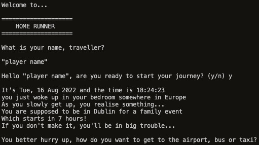

# Home Runner

'Home Runner' is a mini text-based adventure game. The user starts the game at home, and the goal is to reach the airplane by completing challenges on the way.

This is a python terminal game, which runs in the Code Institute mock terminal on Heroku.

Live app link [HERE](https://home-runner.herokuapp.com/).

# How to play

**General**

'Home Runner' is based on the classic 'choose your own adventure' games, which means that the player follows a story, in which they are the main character, and along the way, are prompted to make decisions and win challenges by selecting one of the given options. The player wins the game by winning all challenges with which they are met. 

**Game structure**

In the beginning, the player is asked to input their name, and if they are ready to start the game. If they select yes, then they will be presented with a choice of using a bus or a taxi to reach the airport.

If they choose taxi, then the user is presented with a numbers game challenge, in which they have to guess a number between 0 and 4, in 3 guesses.

If they choose bus, then the user is presented with a mini quiz, in which they have to answer 3 multiple choice questions, of which 2 must be answered correctly. The 3 questions are taken randomly from a list of 10 questions.

If the user fails to complete either of these challenges, then they lose the game, and are presented with the option to play again.

If either of these challenges are completed, then they move on to the next game, which is a turn based battle game. In the battle game, the user battles a security officer at the airport, using 1 out of 3 presented moves. Whoever loses all their HP first, will lose the game. 

If the user loses, it's game over and they'll be presented with the option to start again. If they win the battle, it marks the completion of the final challenge, and the game is completed.

**Flowchart**

I created the following flowchart to help with the linear structure of the game:

# Game features

- Player can enter their name.
- Text is printed slowly to achieve a game like effect.
- Random module is used to generate random numbers.
- Option to play again after game over.
- Object model is used for quiz questions.
  - By doing so I can store the question along with its correct answer, and randomly generate them from a list.
- Score (HP) is tracked during battle game.
- input validation.
  - The user is unable to proceed through the game without inputting the correct data type.
  - If the user enters an invalid data type, they will be prompted to input a correct data type.
  - lower() method is applied to return the lowercase string from the given string for simplicity.
- Potential features to implement:
  - A more elaborate story with more choices and paths to take
  - An overal score tracking system.

# Testing

I have taken the following steps to ensure game functionality:

- I ran the code through the [pep8online](http://pep8online.com/) python validator service. No errors were found.
- I personally ran through the game many times giving many types of invalid input data.
- I tested the game in my local terminal and the Code Institute Heroku Terminal.
- I ran the code through [Black Playground](https://black.vercel.app/) to ensure correct formatting.

# Bugs

There were a few bugs came across while making this project:

- Initially, I had issues with data validation. To fix this, I looped the questions to prompt the user to enter data in a valid format by wrapping my 'if' statement in a 'while' loop.
- When importing strings from the 'constants' module, I kept getting the error message 'IndexError: Replacement index 1 out of range for positional args tuple', and the 'player' variable was not getting passed to the string. I solved this by using the format() method, and numbering the index of the placeholder.

There are currently no bugs in the game.

# Deployment

This project was deployed using Code Institute's mock terminal for Heroku.

- Steps for deployment:
  - Fork or clone this repository
  - Create a new Heroku app
  - Set the buildbacks to Python and NodeJS in that order
  - Link the Heroku app to the repository
  - Click on 'Deploy'

# Credits

- For coding guidance to set up the quiz game I used [this youtube tutorial](https://www.youtube.com/watch?v=SgQhwtIoQ7o&t=161s)
- For coding guidance to set up the battle game I used [this youtube tutorial](https://www.youtube.com/watch?v=k87EDFLZS1o&t=342s)
- For general coding related questions I used [Stackoverflow](https://stackoverflow.com/) and [w3schools](https://www.w3schools.com/)
- Code Institute for the deployment terminal

